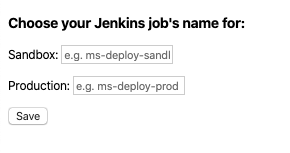
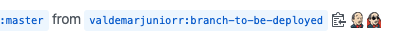
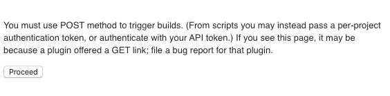

# gh-jks-chrome-plugin
Project to create a icon to deploy your branch into jenkins job

### Get started

- Clone the repository or [download it](https://github.com/valdemarjuniorr/gh-jks-chrome-plugin/archive/master.zip):

```
git clone git@github.com:valdemarjuniorr/gh-jks-chrome-plugin.git
```
- Go to chrome extensions [clicking here](chrome://extensions/).
    - Ensure that the **Developer mode** checkbox in the top right-hand corner is checked.
- Now you can reload extensions. To install the plugin click on the **Load unpacked** icon, in the top left-hand corner, and select cloned or unzipped plugin folder.
- And Voi-là!

### Configuration

To configure sandbox and production job's names you must to go in **Extension options**. To do that:
- Go to chrome extensions [clicking here](chrome://extensions/).
- Find **Github Jenkins plugin** and click on **Details** button.
- And then click in **Extension options**. It will open a html file like this:



- Set sandbox/production job's names and save.

### How to use
Go to your [pull requests list](https://github.com/pulls) and then select any pull request. After _clipboard copy_ icon were added two jenkins icon as below:



The first one represents **Sandbox** e then **Production** icons. When you click in the sandbox icon on, for example, it will open a new chrome tab like this:

.

Then click on **Proceed** button and done! Your job will start in background.
